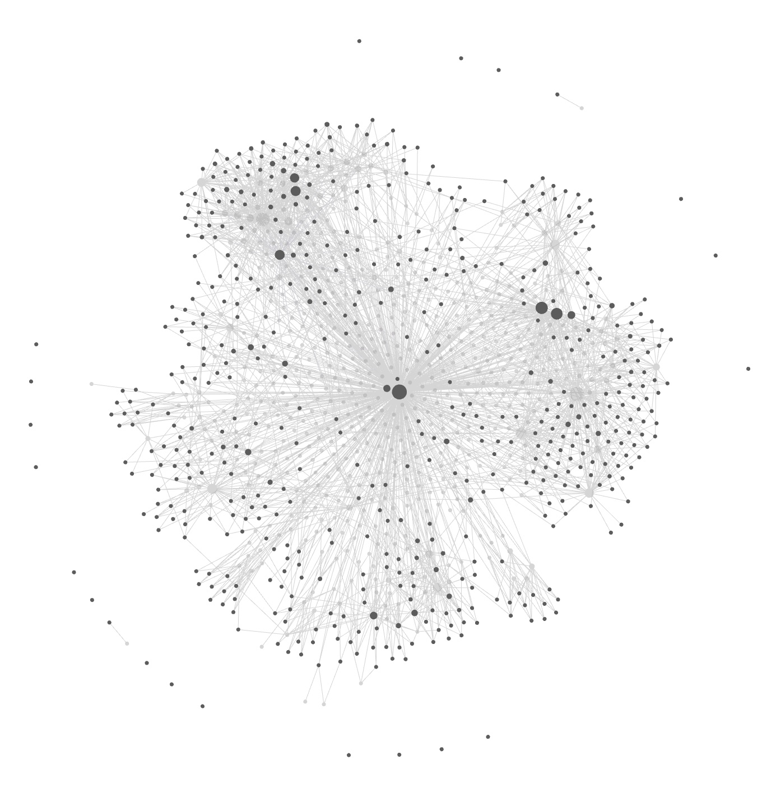

# scribe

`scribe` is a single-binary CLI that creates and maintains a personal, LLM-written knowledge base. It continuously extracts reusable knowledge from your git repos, Claude Code sessions (via [`ccrider`](https://github.com/neilberkman/ccrider)'s FTS5 index) and Codex CLI sessions, links you iMessage to yourself as bookmarks (your own number is the world's most portable read-it-later list), and local files, then compiles it into a curated wiki that [`qmd`](https://github.com/tobi/qmd) indexes for semantic search. Every LLM step resolves through one top-level `llm:` provider block: Anthropic's Claude by default, or a 100% local [Ollama](https://ollama.com) server (gemma3 / qwen3, $0 API cost) — flipping the whole pipeline to free/offline is one line of yaml.

**Not a second brain.** scribe writes a personal *context corpus* — durable LLM memory that survives session boundaries and crosses projects. You almost never read the KB directly; Claude Code and Codex do, every session. The human is at the end of the pipeline, consuming an answer, not navigating a graph. The corpus is plain markdown in git, so it outlives the pipeline that wrote it — if scribe disappears tomorrow, the KB is still yours.

**Not a RAG pipeline. Not a Karpathy-style LLM wiki.** scribe keeps raw sources verbatim under `raw/` AND compiles a structural wiki on top — both layers are indexed, both are searchable. Dense sources fan out into multiple entity-first wiki pages via a two-pass absorb (not one summary per source). LLM-generated retrieval-context paragraphs get spliced into every article so embedding models catch the implicit entities that aren't literally named in the text. The whole pipeline can run fully local on Ollama (gemma3:4b / qwen3:4b, $0 API cost).

Your KB is a private git repo you own. `scribe init` scaffolds it from embedded templates; you pick the KB name, domains, owner context, and capture handles. After the first run you edit `scribe.yaml` freely — everything that used to be hardcoded lives there. Then `scribe cron install` drops a set of macOS LaunchAgents (Linux: paste-ready crontab lines) and the KB starts growing on its own every time you commit code, use Claude Code, or text yourself a link.

---

## Why bother

**1. Claude Code *and* Codex CLI become *context-aware* across sessions.** `scribe init` writes a block into `~/.claude/CLAUDE.md` **and `~/.codex/AGENTS.md`** parameterized with the KB name you picked (e.g. `mykb`, `acme-notes`, or whatever you chose during init). That block tells the agent to consult your KB via [qmd](https://github.com/tobi/qmd) — using the collection name that matches your KB — before answering architectural questions, recommending a library, or reproducing a pattern. Mention a project name in any Claude Code *or* Codex session and the agent queries the KB first, pulling prior decisions, rejected tools, past solutions, and the project's own learnings log. No more re-explaining the same context every session; no more the agent suggesting the library you already evaluated and rejected six weeks ago. (Use one agent or both — the drop-file contribution path is shared, so knowledge captured from a Codex session is searchable from a Claude session and vice versa.)

Excerpt from the block `scribe init` writes (`{{.KBName}}` gets replaced with your KB name, `{{.OwnerName}}` with yours):

> **How to search:** Use the `mcp__plugin_qmd_qmd__query` tool when available (preferred), or `qmd query "<natural language question>"` via Bash. Both work from any directory — qmd collections use absolute paths, so **never `cd` into {{.KBDir}} first**.
>
> **When to search proactively — don't wait for {{.OwnerName}} to ask.** The KB is only valuable if it's consulted before decisions, not after.
> - Before recommending a library, tool, or framework — query `"<name> evaluation verdict"`. Don't suggest something already rejected.
> - Before proposing an architectural choice — query `"<problem> decision reasoning"`. Cite the prior decision instead of reinventing it.
> - When {{.OwnerName}} references past work ("have I done this before", "didn't we decide on X", "which tool did I use for X") — these are direct instructions to search. Don't answer from memory; search.

That single prompt turns your KB into working memory for every agent session. Without it, an LLM-written KB is just a write-only archive. The full block (including the drop-file protocol for contributing from other projects) is in [`cmd/scribe/templates/claude-md-kb.md`](cmd/scribe/templates/claude-md-kb.md); the Codex variant (shell `qmd` instead of the MCP tool) is [`cmd/scribe/templates/codex-agents-md.md`](cmd/scribe/templates/codex-agents-md.md). Skip the Codex file with `scribe init --no-codex-md`, the Claude file with `--no-claude-md`.

**2. It runs itself.** Set it up once, then go back to your regular work. Cron handles the rest:

- Every hour: auto-commit the KB.
- Every 2 hours: scan git repos for new decisions, patterns, learnings; extract them via `claude -p`.
- 3×/day (03:00, 12:00, 18:00): mine Claude Code sessions via ccrider's FTS5 index — and Codex CLI rollouts when `codex.mine` is enabled — scored by keyword density so boilerplate sessions cost nothing.
- Every 30 min: drain queued URLs into `raw/articles/`.
- Every 4 hours: pull bookmark-links you texted yourself.
- Daily 06:30: retry previously-unfetched link stubs (`capture-refetch`).
- Daily 12:30: structural lint pass over the KB.
- Sat 01:00: weekly frontmatter auto-repair (`lint-fix`).
- Sat 01:30: conflict-resolution LLM pass over contradictions (`lint-resolve`).
- Sat 01:45: identity-clustering pass — finds alias clusters across people/tools (`lint-identities`).
- Sat 01:55: auto-apply high-confidence alias clusters (`apply-identities`).
- Sun 02:00: weekly Dream cycle — a 4-phase structured consolidation.
- Continuous (`KeepAlive`): fsnotify watcher on the ccrider DB for near-real-time session extraction (`scribe watch`).

Nothing demands your attention. You keep working; the KB grows. After two weeks of ordinary Mac use and no manual bookkeeping, the maintainer's personal KB looked like this (Obsidian graph view, 884 files, 45 folders, every node a wikilink in the auto-generated graph):

<p align="center">
  
  <br/>
  <em>scriptorium KB after ~2 weeks of normal work. Zero manual note-taking.</em>
</p>

**3. Knowledge compounds across projects.** This is the killer feature for anyone juggling more than one codebase. Research, decisions, rejected tools, solved bugs, and reusable patterns live in one KB — not siloed per-project. When you hit a problem in project B that you already solved in project A six weeks ago, Claude Code surfaces the old solution automatically via the qmd query path above; manual work is `qmd query "<natural-language question>"` from any terminal in any directory.

Concrete examples from two weeks of the maintainer's normal use:

- Evaluated a Go cron library for project A → two weeks later started another Go CLI in project B; Claude pulled the prior evaluation and skipped re-researching the alternatives.
- Hit an Oban worker idempotency bug in a Phoenix project → wrote the fix into `wiki/patterns/idempotent-worker-skeleton.md` → three days later, different Phoenix project, same pattern surfaced without asking.
- Tagged an iMessage bookmark about FTS5 MATCH syntax (not parameterizable) → six weeks later, SQL-injection lint fired on a different project; the KB had the exact answer and the workaround.

Without a cross-project KB, each project re-learns the same lessons. With one, the second, third, and fourth time you hit a recurring problem are all fast. The drop-file protocol (see `scribe.yaml` docs) means knowledge generated *inside* any project — `.claude/scribe/YYYY-MM-DD-*.md` — gets absorbed into the central KB on the next cron tick. Write once, find everywhere.

**4. You own the substrate.** It's a git repo of plain markdown files. Push it to your own GitHub, Gitea, or Forgejo. Open it in Obsidian, VS Code, `vim`, or `mdbook`. Grep it with `ripgrep`. No vendor lock-in, no cloud account, no subscription — if scribe disappears tomorrow, you still have the KB.

---

## What you get after a week

After about a week of normal work on existing projects, the KB has grown itself into something like this. **The directory shape is real (it matches scribe's `wikiDirs` constant); the filenames below are illustrative — yours will be whatever your actual work produces:**

```
my-kb/
├── scribe.yaml                    # your config, edit freely
├── wiki/
│   ├── _index.md                  # auto-generated, entity index
│   ├── _hot.md                    # 500-word rolling context Claude reads on every session
│   ├── _backlinks.json            # reverse-link graph, O(1) lookup
│   ├── decisions/
│   │   ├── chose-oban-over-quantum.md
│   │   └── dropping-circuit-breaker-middleware.md
│   ├── patterns/
│   │   ├── idempotent-worker-skeleton.md
│   │   └── phoenix-scope-based-auth.md
│   ├── learnings/
│   │   ├── why-my-liveview-reconnect-loops.md
│   │   └── fts5-match-cant-be-parameterized.md
│   ├── tools/
│   │   ├── oban.md                # verdict: use
│   │   └── quantum.md              # verdict: skip, with reason
│   ├── research/
│   │   └── 2026-04-auth-library-comparison.md
│   └── projects/
│       └── my-app/
│           ├── overview.md
│           ├── learnings.md       # rolling, append-only
│           └── decisions-log.md
├── raw/articles/                  # verbatim sources (URLs, tweets, imessage clips)
└── output/runs/2026-04-*.jsonl    # per-invocation telemetry for `scribe doctor`
```

Every file has YAML frontmatter (`type:`, `domain:`, `confidence:`, `tags:`, `related:`) so you can filter and traverse programmatically. Every article links to every other article via `[[wikilinks]]`, and `scribe link` auto-injects *See Also* sections into orphans based on shared tags. `qmd query "<natural language question>"` returns semantic hits with snippets — from inside the KB, from any terminal, no `cd` required.

One concrete loop: you work on `my-app`, hit a tricky bug in your LiveView, Claude Code helps you fix it. Thirty minutes later `scribe sync --sessions` mines that session via ccrider's FTS5 index, extracts the root cause + fix + tradeoff, writes it into `wiki/learnings/`, cross-links it to `wiki/patterns/phoenix-scope-based-auth.md`, auto-commits + pushes. Two weeks later you hit a similar bug on a different project; `qmd query` surfaces the old learning before you re-debug it.

---

## Install

### Homebrew (macOS, Linux/Linuxbrew)

```sh
brew tap oliver-kriska/scribe
brew install oliver-kriska/scribe/scribe
```

### Shell installer

```sh
curl -fsSL https://raw.githubusercontent.com/oliver-kriska/scribe/main/install.sh | bash
```

Pin a specific release:

```sh
curl -fsSL https://raw.githubusercontent.com/oliver-kriska/scribe/main/install.sh | bash -s -- --version v0.1.0
```

The installer writes to `$HOME/.local/bin/scribe` by default; pass `--prefix` to change it.

### From source

Requires Go ≥ 1.26 and a C toolchain (for `go-sqlite3` with FTS5 support):

```sh
git clone https://github.com/oliver-kriska/scribe.git
cd scribe
make install    # builds with -tags sqlite_fts5 and drops binary in ~/.local/bin
```

---

## Runtime dependencies

`scribe doctor` will tell you which are missing.

| Tool          | Required | Used for                             | Install                                         |
| ------------- | -------- | ------------------------------------ | ----------------------------------------------- |
| `claude`      | yes      | session extraction + absorb          | `curl -fsSL https://claude.ai/install.sh \| bash` |
| `ccrider`     | yes      | session database for `scribe triage` | `brew install neilberkman/tap/ccrider` (or bundled as a scribe dep via Homebrew) |
| `qmd`         | yes      | semantic search over the KB          | `npm install -g @tobilu/qmd`                    |
| `sqlite3`     | yes      | chat.db + ccrider reads              | `brew install sqlite` / `apt install sqlite3`   |
| `git`         | yes      | KB auto-commit + cron sync           | system package                                  |
| `trafilatura` | no       | URL → markdown (fallback: Jina)      | `pipx install trafilatura`                      |
| `jq`, `fzf`   | no       | manual triage / preview              | `brew install jq fzf` / apt                     |

> Installing scribe via Homebrew (`brew install oliver-kriska/scribe/scribe`)
> also pulls `git`, `sqlite`, and `ccrider` automatically. `claude`, `qmd`,
> and the optionals still need their own installs.

---

## Quick start

```sh
scribe init --path ~/my-kb
cd ~/my-kb
git remote add origin git@github.com:you/my-kb.git   # optional
scribe cron install
scribe doctor
```

`scribe init` will prompt for:

- **Owner name** — used in the CLAUDE.md block Claude Code reads every session.
- **Owner context** — one paragraph: who you are, what you work on, how you think.
- **Domains** — comma-separated list for the `domain:` frontmatter field. `personal` and `general` are always added.
- **iMessage self-chat handle** — phone number or email you iMessage yourself at (optional; leave empty to disable capture).

Everything gets written into `scribe.yaml` at the KB root. Re-run `scribe init --check` any time to re-validate against dependencies and templates.

On macOS, if you gave a self-chat handle, `scribe init` finishes by offering to walk you through Full Disk Access for the scribe binary (needed by `scribe capture`). You can skip and run `scribe fda` later — see [Full Disk Access](#full-disk-access-for-scribe-capture) below.

### Non-interactive

All prompts take matching flags:

```sh
scribe init \
  --path ~/my-kb \
  --owner-name "Alice" \
  --owner-context "Platform engineer. Main projects: weblog, infra." \
  --domains weblog,infra \
  --handle "+15551234567" \
  --yes
```

---

## Cron

### macOS — LaunchAgents

```sh
scribe cron install     # writes ~/Library/LaunchAgents/com.scribe.*.plist
scribe cron status      # shows loaded/present/missing for each job
scribe cron uninstall   # removes agents
```

macOS cron runs under `launchd` without a login Aqua session, so it can't reach the login keychain — which breaks `claude -p`. `scribe cron install` installs the jobs as user LaunchAgents in the `gui/<uid>` domain instead, which do have keychain access.

#### Full Disk Access for `scribe capture`

macOS won't let any process read `~/Library/Messages/chat.db` without Full Disk Access. Apple disallows programs from granting themselves FDA, so the toggle itself is unavoidable — but everything else is automated:

```sh
scribe fda
```

That command:

1. Detects every scribe binary on disk (`~/.local/bin/scribe`, the mise-managed copy, etc.) and reports which already have FDA.
2. Opens **System Settings → Privacy & Security → Full Disk Access** directly via the `x-apple.systempreferences:` URL.
3. Prints the full path to each missing binary — paste it into the file picker (Cmd-Shift-G), Enter, then toggle the checkbox.
4. Polls every 3 seconds for up to 2 minutes; flips a `✓` next to each binary the moment its grant lands.
5. Reminds you to reload LaunchAgents (`scribe cron uninstall && scribe cron install`) so running jobs pick up the grant.

`scribe fda --verify` is the scriptable form: exit 0 if the current binary has FDA, non-zero otherwise. `scribe init` prompts once at the end of a fresh bootstrap; `scribe doctor` surfaces ungranted state in its **Recent run errors** section with a direct `run: scribe fda` fix hint.

Manual fallback if you ever need it: System Settings → Privacy & Security → Full Disk Access → **+** → add the paths `scribe fda` lists.

### Linux — manual crontab

On Linux, `scribe cron install` prints crontab(5) lines you paste into `crontab -e`. Example output:

```
# ---- scribe ----
SHELL=/bin/bash
PATH=/home/alice/.local/bin:/usr/bin:/bin:...

# Hourly KB auto-commit
7 */1 * * * cd "/home/alice/my-kb" && /home/alice/.local/bin/scribe commit

# Project extraction every 2h
23 */2 * * * cd "/home/alice/my-kb" && /home/alice/.local/bin/scribe sync --max 2

# Session mining at 3:00, 12:00, 18:00
0 12 * * * cd "/home/alice/my-kb" && /home/alice/.local/bin/scribe sync --sessions --sessions-max 3 --skip-large
0 18 * * * cd "/home/alice/my-kb" && /home/alice/.local/bin/scribe sync --sessions --sessions-max 3 --skip-large
0 3  * * * cd "/home/alice/my-kb" && /home/alice/.local/bin/scribe sync --sessions --sessions-max 3 --skip-large

# Drain queued URLs into raw/articles/ every 30min
*/30 * * * * cd "/home/alice/my-kb" && /home/alice/.local/bin/scribe ingest drain

# Weekly Dream cycle (Sun 2am)
0 2 * * 0 cd "/home/alice/my-kb" && /home/alice/.local/bin/scribe dream
# ---- end scribe ----
```

The `scribe watch` job (fsnotify watcher for ccrider's SQLite DB) is not cron-friendly — run it under systemd-user, supervisord, or a persistent tmux/screen session. `scribe cron install` on Linux names the jobs that fall into this category so you know what still needs a supervisor.

`scribe doctor` works the same on either OS: it reads `output/runs/*.jsonl` for freshness and recent errors, so you can verify scheduled jobs are firing regardless of how they're scheduled.

---

## Configuration

### `scribe.yaml` (KB root)

Primary config file. Written by `scribe init`, edit freely. Highlights:

```yaml
owner_name: "..."
owner_context: |
  ...one paragraph Claude sees every session...

# Domains the validator accepts. 'personal' and 'general' are always accepted.
domains:
  - work
  - oss

claude_projects_dir: ~/.claude/projects
codex_sessions_dir: ~/.codex/sessions   # optional — Codex CLI rollouts; `sync --discover` walks these alongside Claude
ccrider_db: ~/.config/ccrider/sessions.db

default_model: sonnet # claude model used for extraction/dream/absorb

# Codex CLI session mining (opt-in). Project discovery from
# codex_sessions_dir above needs no extra config; this block additionally
# distills the Codex transcripts themselves into the KB — the same
# triage→envelope→wiki path ccrider sessions get, run inside
# `scribe sync --sessions`. A no-op without codex_sessions_dir. The LLM
# provider/model/prompt are inherited from session_mine: (Codex mining is
# ccrider mining with the transcript source swapped).
codex:
  mine: true            # default false — set true to turn the pass on
  sessions_max: 3       # cap mined Codex sessions per sync run
  lookback_hours: 168   # bound the rollout scan (7d); log is the real dedup
  min_score: 2          # scoreText threshold a transcript must clear

capture:
  # Use the list form (`self_chat_handles`) if you message yourself from both a
  # phone and an Apple-ID email — iMessage stores those as separate chats and
  # the singular form only reads one of them. The legacy singular still works.
  self_chat_handles:
    - "+15551234567"
    - "you@example.com"

# Keyword categories for `scribe triage`. Tune to your stack.
triage:
  keywords:
    decision: "decided OR chose OR tradeoff OR alternative"
    code_pattern: "GenServer OR LiveView OR Ecto OR ..."
    # ... architecture, research, learning, evaluation, deep_work
  weights:
    decision: 3
    code_pattern: 1
    # ... matching weights for each category
```

### Local-mode — 100% Ollama (free, offline)

As of 0.2.14, **every LLM-driven subcommand can run end-to-end against a local [Ollama](https://ollama.com) server** with zero Anthropic calls. `dream`, `assess`, `deep`, `session-mine`, `relations migrate`, all four absorb passes, and `contextualize` resolve their backend through a single top-level `llm:` block. The Anthropic path stays the default; flipping the whole pipeline to free/offline is one line of yaml.

**One-time setup:**

```sh
brew install ollama
# macOS: Ollama auto-registers as a launchd service, so `ollama serve` is already running.
```

**Flip the whole pipeline to local** — edit `scribe.yaml`:

```yaml
llm:
  provider: ollama
  model: gemma3:12b              # cross-op default; per-op blocks override
  ollama_url: http://localhost:11434
  num_ctx: 16384                 # safe floor for envelope-mode ops
```

That's it. Every per-op block (`dream`, `assess`, `deep_ingest`, `session_mine`, `relations`, `absorb.pass1`, `absorb.pass2`, `absorb.single_pass`, `absorb.facts`, `absorb.contextualize`) inherits `provider` + `model` + `ollama_url` + `num_ctx` from `llm:` when its own fields are empty. Set any per-op `provider:`/`model:` to override for that op only (typical: pin a bigger model on `absorb.pass2`, keep the small fast model everywhere else).

**Auto-flip:** scribe forces the right *mode* on each op when `llm.provider: ollama` so the `claude -p` paths can't silently no-op. You'll see config log lines like:

```
config: dream.provider="ollama" forces mode=orchestrator (was "monolithic")
config: assess.provider="ollama" forces mode=envelope (was "tools")
config: session_mine.provider="ollama" forces mode=envelope (was "tools")
config: absorb.pass2_provider="ollama" forces pass2_mode=json (was "tools")
```

**Pre-flight check:**

```sh
scribe doctor --section localmode
```

Validates: Ollama reachable; `llm.model` pulled; `absorb.pass2_model` pulled; `absorb.atomic_facts` on (recommended under local pass-2); `sync.daily_anthropic_output_token_ceiling` configured.

**What runs where on a typical 32 GB Mac:**

| Op                            | Default model       | num_ctx | Notes                                    |
| ----------------------------- | ------------------- | ------- | ---------------------------------------- |
| `contextualize`, `facts`      | `gemma3:4b`         | 8192    | Cheap, high-throughput per-chunk pass    |
| `absorb.pass1`                | inherits `llm.model`| 8192    | Entity-list extraction, fast             |
| `absorb.pass2`                | `gemma3:27b`        | 16384   | Highest-quality wiki writes; pin per-op. On Apple Silicon prefer MoE `qwen3:30b-a3b` (~4× faster, same class) |
| `dream`, `assess`, `deep`     | inherits `llm.model`| 16384–32768 | Envelope orchestrators                |
| `session-mine`                | inherits `llm.model`| 16384   | Transcript inlined, capped at 24K chars  |

On the next `scribe sync` (or any subcommand) scribe will:

1. Probe `http://localhost:11434/api/tags` to confirm Ollama is up.
2. Check if the chosen model is already pulled.
3. If not, call `/api/pull` in streaming mode and wait for completion (one-time download).
4. Run generation via `/api/generate` with the resolved `num_ctx`.

No manual `ollama pull` needed — though `ollama pull gemma3:12b && ollama pull gemma3:27b` ahead of time avoids a cold-start delay on the first sync.

**Recommended models (May 2026):**

| Model         | Size   | When to pick                                     |
| ------------- | ------ | ------------------------------------------------ |
| `gemma3:4b`   | 3.3 GB | **Default.** Best speed/quality on Apple Silicon |
| `qwen3:30b-a3b-instruct-2507` | ~18 GB | **Best higher-quality local pick on Apple Silicon.** MoE (~3B active) → 27–30B-class quality at small-model speed; ideal for `absorb.pass2` in place of dense `gemma3:27b` |
| `qwen3:4b`    | ~2.5 GB | Richer prose, slightly more verbose              |
| `llama3.2:3b` | ~2 GB  | Smaller footprint, older-generation              |
| `phi4-mini:3.8b` | ~2.5 GB | Reasoning-focused, less natural writing output |

All are free and work with scribe's auto-pull. Pick with `model: <tag>` in scribe.yaml. llama.cpp's `llama-server` exposes the same `/api/generate` shape, so `ollama_url: http://localhost:8080` also works if you prefer raw llama.cpp over Ollama.

> **Apple Silicon tip.** LLM decode is memory-bandwidth-bound, so dense 24–32B models are slow on non-Max chips (≈10 tok/s for a 27–31B on an M4 Pro). Mixture-of-Experts models like `qwen3:30b-a3b-instruct` activate only ~3B params per token, reaching ≈40 tok/s on Ollama (≈90 tok/s via MLX) at similar quality — the better high-quality pick when you don't have an M-series Max/Ultra.

> **Note.** Local-mode covers every LLM-driven subcommand as of 0.2.14 — `dream`, `assess`, `deep`, `session-mine` (including Codex session mining, which inherits the `session_mine:` backend), `relations migrate`, and the four absorb passes. `contextualize` was first (pre-0.2.11); Phase 4A added `facts_provider: ollama`; Phase 4B added `pass2_mode: json` + `pass2_provider: ollama` (0.2.11); Phase 4C/4D/4E (0.2.14) ported the four remaining `claude -p` orchestrators onto bounded JSON-envelope subtasks, and a top-level `llm:` block now wires it together so flipping the whole pipeline is one line of yaml.

### `~/.config/scribe/config.yaml` (user)

Written by `scribe init`. Points scribe at your KB so you can run commands from any directory:

```yaml
kb_dir: /home/alice/my-kb
```

### Environment variables

| Variable                   | Purpose                                                                                                                   |
| -------------------------- | ------------------------------------------------------------------------------------------------------------------------- |
| `SCRIBE_KB`                | Override KB root for one command                                                                                          |
| `SCRIBE_SELF_CHAT_ID`      | Override `capture.self_chat_handle` (accepts comma-separated values for accounts with phone + Apple-ID email)             |
| `SCRIBE_SKIP_REINDEX`      | Skip the final `qmd` reindex (useful in tests / CI)                                                                       |
| `SCRIBE_PROJECT_ROOTS`     | Colon-separated list of parent dirs treated as top-level project roots (default: `Projects:projects:src:code:repos:work`) |
| `SCRIBE_PASS2_MODE`        | Override `absorb.pass2_mode` (`tools` or `json`) for one run without editing scribe.yaml                                  |
| `SCRIBE_PASS2_PROVIDER`    | Override `absorb.pass2_provider` (`anthropic` or `ollama`) for one run                                                    |
| `SCRIBE_PASS2_MODEL`       | Override `absorb.pass2_model` for one run                                                                                  |
| `SCRIBE_BYPASS_BUDGET`     | Bypass `sync.daily_anthropic_output_token_ceiling` for one invocation (cron-safe ceiling otherwise aborts and exits 0)    |
| `SCRIBE_DOCTOR_SKIP_OLLAMA`| Skip the Ollama `/api/tags` probe in `scribe doctor --section localmode` (offline CI)                                     |

---

## Command reference

```sh
scribe init         # bootstrap a KB or check an existing one
scribe sync         # discover → extract → absorb → reindex
scribe sync --sessions       # mine Claude Code (ccrider) + Codex CLI sessions (when codex.mine is on)
scribe sync --estimate       # token estimate for pending work (no LLM calls)
scribe sync --max-absorb N   # one-shot override of absorb.max_per_run from scribe.yaml
scribe triage       # score unprocessed sessions by knowledge density
scribe capture      # pull links you iMessaged to yourself as bookmarks (macOS only; needs Full Disk Access)
scribe ingest url <url> --absorb   # queue-less ingest + contextualize + absorb
scribe absorb <file>         # absorb a local file (md/txt/html) end-to-end
scribe contextualize --scope raw|wiki|all   # insert retrieval-context paragraphs
scribe status       # one-shot KB scoreboard (raw/wiki/ollama/last-sync)
scribe dream        # weekly memory consolidation (4-phase)
scribe lint         # frontmatter + size + orphan checks
scribe lint --contradictions # LLM pass for factual disagreements across articles
scribe link         # link orphan articles to contextual hosts via See Also sections
scribe watch        # long-running fsnotify watcher on ccrider DB (near-real-time session extraction)
scribe assess <project>      # one-shot parallel deep assessment of a project (5 tracks + consolidation)
scribe cost         # summarize claude -p calls (count, wallclock, USD estimate) from the cost ledger
scribe sections {build,list,get}            # H1/H2/H3 section sidecars for wiki articles (Phase 5A)
scribe tier {compute,list,set,write}        # index_tier hint (stub|brief|standard|deep|reference) (Phase 5B)
scribe relations {get,set,rm,graph,check,migrate,migrate-revert}   # typed edges between articles (Phase 6A)
scribe contradictions {build,list,show,resolve}                    # contradiction ledger (Phase 6B)
scribe stale {build,list,show}                                      # staleness ledger (date + source signals) (Phase 6C)
scribe view {<name>,--list}                 # declarative views over wiki frontmatter (Phase 7B)
scribe skill {install,list}                 # embedded scribe-kb agent skill bundle (Phase 7A)
scribe install-tools         # bootstrap optional tools (uv + marker-pdf) for full PDF/DOCX/PPTX/XLSX/EPUB ingestion
scribe doctor       # deps + config + cron + freshness + errors + localmode + vault + stale + contradictions
scribe fda          # macOS Full Disk Access probe + interactive grant flow
scribe cron {install,status,uninstall}
```

Run `scribe <cmd> --help` for the full flag set of each. A handful of internal plumbing commands (`backlinks`, `index`, `orphans`, `validate`, `hook`, `hot`, `write`, `debug`, `sessions`, `commit`, `scan`, `deep`) are also available — they're invoked by `scribe sync` and `scribe dream` under the hood, but can be run standalone for debugging.

---

## How scribe differs from other tools

Since Karpathy's LLM-wiki gist in April 2026, a handful of open-source takes have appeared. Scribe lives in the same neighborhood but optimizes for different tradeoffs. A quick honest map.

> **Snapshot: 2026-04-21.** The tools listed below are moving targets — feature sets, stars, and design decisions change month-to-month. The comparison reflects what their public source looked like on this date, verified by reading the code rather than the README. If you're reading this months later, check each repo for recent changes before making a decision.

| Tool                             | Session mining                   | Cron-driven             | Density pre-filter    | Two-pass absorb | Multi-project | Local-mode option  |
| -------------------------------- | -------------------------------- | ----------------------- | --------------------- | --------------- | ------------- | ------------------ |
| **scribe**                       | ✅ ccrider FTS5 + Codex rollouts  | ✅ LaunchAgents / cron   | ✅ BM25 triage         | ✅ fan-out       | ✅             | ✅ Ollama / llama.cpp |
| `coleam00/claude-memory-compiler` | ✅ every session, no filter       | ❌ opportunistic         | ❌ (see issue #3: $115 in 20 min) | ❌             | ❌             | ❌                  |
| `AgriciDaniel/claude-obsidian`   | ❌ read-time only                 | ❌                       | n/a                   | ❌              | read-only     | ❌                  |
| `nvk/llm-wiki`                   | ❌                                | ❌ one-shot `/wiki:assess` | n/a                  | ❌              | ❌             | ❌                  |
| `basicmachines-co/basic-memory`  | ❌ (open issue #669 since 2026-03) | ❌ cron suggested        | n/a                   | ❌              | ✅ via projects | ❌                  |
| LangChain / LlamaIndex RAG       | ❌                                | n/a (indexing only)     | n/a                   | ❌ chunks only   | ✅             | varies             |
| Obsidian / Notion / Reflect      | ❌ manual                         | ❌                       | n/a                   | ❌              | ✅ manual      | n/a                |

### Where scribe's niche is

- **Against RAG stacks (LlamaIndex, LangChain, classic embedding pipelines).** RAG stores chunks and retrieves at query time — there's no curation layer, no named entity pages, no decision log. Scribe keeps raw sources AND compiles a structural wiki on top. The wiki is the product; qmd embedding is the index into it.
- **Against manual note-taking (Obsidian, Notion).** Those expect you to do the writing. Scribe watches your git commits, Claude Code sessions, and self-sent URLs, then writes the notes. You review and curate, the LLM does the data-entry.
- **Against `claude-memory-compiler`.** Memory-compiler runs an LLM call on *every* Claude Code session with ≥1 turn. A single Max-20x user burned $115 in 20 minutes on issue #3. Scribe's `scribe triage` scores sessions by BM25 keyword density *before* calling Claude, so boilerplate sessions never cost anything. `sync --max` caps project-extraction work; the rate-limit bail-out hands cleanly to the next cron run instead of blocking.
- **Against `claude-obsidian` and `nvk/llm-wiki`.** Those are read-time research companions — plugin skills and slash commands, no binary, no cron. Great for interactive investigations, not for background absorption of weeks of work. Scribe runs as a scheduled daemon and produces the KB whether or not you open a terminal that day.
- **Against `basic-memory`.** Basic-memory has the best graph model of the bunch (inline `[decision]` observations, auto-generated relations). What it doesn't do is ingest Claude Code session transcripts (open feature request since March 2026) or iMessage self-chat URLs, and its Dream-analog skills aren't scheduled. Scribe covers those; if you want the richer graph DSL, basic-memory is the reference.

### What scribe is *not* trying to be

- Not a drop-in replacement for agent runtime memory (mem0, Letta, Zep, Cognee, Supermemory). Those live in-process behind an agent; scribe is a file-tree on disk you can grep.
- Not a SaaS product. No server to host, no account, no sync tier. The KB is a git repo you own — push it to your own GitHub/Gitea/Forgejo, or keep it purely local.
- Not opinionated about your editor. Scribe writes plain markdown with frontmatter. Obsidian, VS Code, or `vim` all render it fine; Obsidian users get wikilinks for free.

---

## License

MIT.
